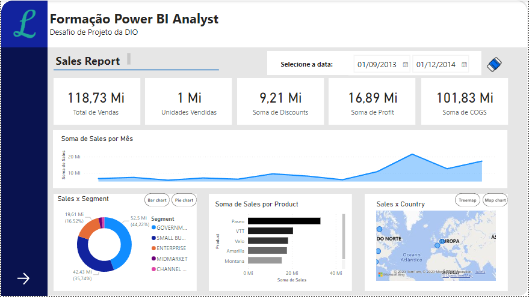
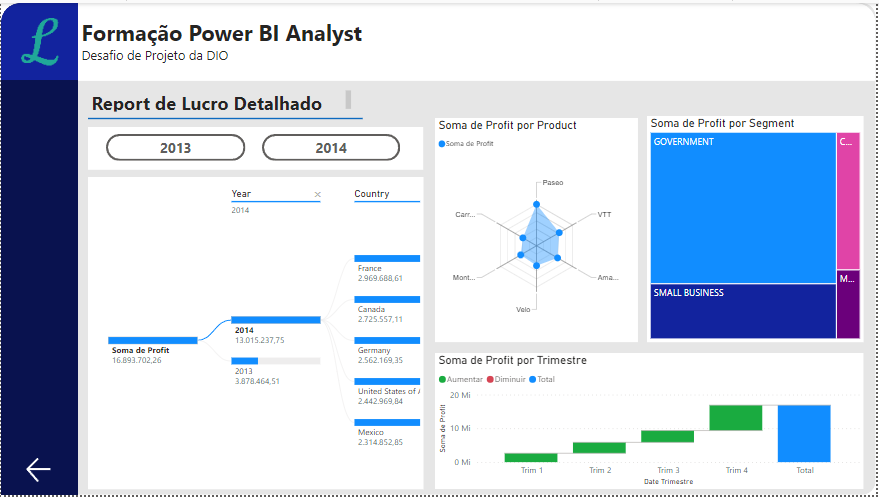

# Desafio 01 - Power BI
## Santander Bootcamp 2023 - Ciência de Dados com Python

Queria compartilhar com vocês o desafio que recebi de criar um relatório mais elaborado com base na sample financials do Power BI. Foi uma experiência desafiadora, mas de muito aprendizado!

Primeiro, baixei os arquivos de dados disponíveis no GitHub do projeto, no link: https://github.com/julianazanelatto/power_bi_analyst. 

A estrutura definida foi a base para o meu relatório. Garanti que todos os elementos estivessem organizados de forma lógica e fácil de entender. Além disso, adicionei botões de navegação para proporcionar uma experiência mais fluida aos usuários que interagirem com o relatório.

Os segmentadores foram fundamentais para permitir aos usuários selecionar diferentes visuais sobre o mesmo assunto. E para deixar tudo mais intuitivo, associei imagens aos botões (ex: botão da borracha, que reseta as datas), facilitando a identificação e utilização.

Seguindo os vídeos de passo a passo disponíveis, pude criar os objetos que definem o layout do relatório de maneira eficiente. Os gráficos foram especialmente desafiadores, mas com paciência e seguindo as instruções, consegui compreender os campos que os compõem, garantindo uma representação visual clara dos dados.

Além disso, não me esqueci dos botões para navegabilidade, que são essenciais para facilitar a movimentação dentro do relatório, proporcionando uma experiência de usuário mais agradável. Ao clicar nas setas, no canto inferior esquerdo do relatório, é possível navegar entre as páginas.

Os segmentadores de dados foram utilizados de forma estratégica, permitindo uma filtragem precisa das informações apresentadas no relatório. Isso contribuiu para que os usuários pudessem explorar diferentes perspectivas dos dados de maneira fácil e rápida.

Em resumo, cada passo desse desafio foi uma oportunidade de aprendizado e aplicação prática dos conceitos do Power BI. O resultado final foi satisfatório!

